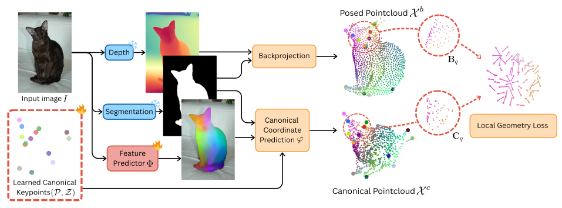
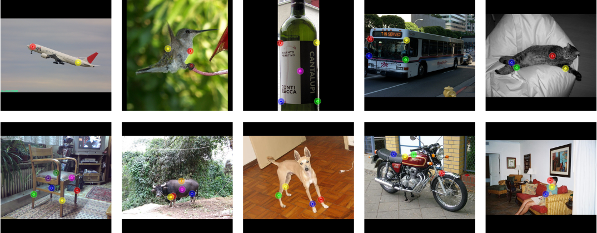

# *Jamais Vu*: Exposing the Generalization Gap in Supervised Semantic Correspondence


**Jamais Vu** investigates the lack of generalization of recent *semantic correspondence* (SC) models.
We introduce a new benchmark **SPair-U** that functions as a drop-in replacement for the standard SPair-71k evaluation set and focuses on generalization to new semantic points.
We also propose an additional loss based on matching individual object instances to a *3D canonical category prototype* in order to build more robust correspondence systems.
Our findings show that despite their impressive scores on previous benchmarks, supervised models fail to generalize beyond their unsupervised backbone on our new benchmark.

This repository is the official implementation of the paper:

[**Jamais Vu: Exposing the Generalization Gap in Supervised Semantic Correspondence**](https://arxiv.org/abs/2311.17034)
*Octave Mariotti, Zhipeng Du, Yash Bhalgat, Oisin Mac Aodha, Hakan Bilen*.
NeurIPS 2025.

- [Environment Setup](#environment-setup)
- [Get Started](#get-started)
  - [Prepare the data](#prepare-the-data)
  - [Pre-extract the feature maps](#pre-extract-the-feature-maps)
  - [Get the instance masks](#get-the-instance-masks)
  - [Get the point maps](#get-the-point-maps)
- [Training](#training)
- [Inference](#inference)
  - [SPair-U](#spair-u)
  - [Running inference](#running-inference)
- [Citation](#citation)
- [Acknowledgement](#acknowledgement)


> [!NOTE]  
> This repository is an extension of [GeoAware-SC](https://github.com/Junyi42/GeoAware-SC).
We reused most of the data preprocessing and training scripts.
Our model is only trained using SPair data, however, it should be straightforward to perform training on PF-PASCAL or AP-10k using the scripts from GeoAware-SC

## Environment Setup

To install the required dependencies, use the following commands:

```bash
conda create -f JamaisVu.yml
conda activate JamaisVu
pip install -e .
```


## Get Started

### Prepare the data

Scripts to download the datasets are provided in the `data` folder. To download specific datasets, use the following commands:

* SPair-71k: 
```bash
bash data/prepare_spair.sh
```

### Pre-extract the feature maps

To enable efficient training and evaluation, we pre-extract the feature maps of the datasets.
To do so, run the following commands:

* SPair-71k: 
```bash
python preprocess_map.py ./data/SPair-71k/JPEGImages
```

For the SPair-71k dataset, it takes roughly 2 hours to extract the feature maps (for both the original and flipped images) on a single RTX 3090 GPU, and consumes around 90GB of disk space. 

### Get the instance masks

You can download our pre-extracted owlv2 masks [here](https://groups.inf.ed.ac.uk/hbilen-data/data/JamaisVuData/SPair_owlv2_sam_masks.zip) and extract them in `./data/SPair-71k/owlv2_sam_masks`.

Alternatively, you can use your favorite segmentation model to extract instance masks and edit `pck_train.py` with the path to your masks.

### Get the point maps


You can download our pre-extracted [MoGe](https://github.com/microsoft/MoGe) pointmaps [here](https://groups.inf.ed.ac.uk/hbilen-data/data/JamaisVuData/SPair_MoGe_maps.zip) and extract them in `./data/SPair-71k/MoGeMaps`.

Alternatively, you can use your favorite model to extract pointmaps and edit `pck_train.py` with the path to your maps.


## Training



Our training script [pck_train.py](pck_train.py) is adapted from that of [GeoAware-SC](https://github.com/Junyi42/GeoAware-SC). It accepts the same arguments and is run the same way:

```bash
python pck_train.py --config configs/config_file.yaml
```

We added a flag `--CAT_PROTO` to train models using our additional geometric objective using category prototypes.


## Inference

### SPair-U



We introduce **SPair-U**, a benchmark designed to evaluate the generalization ability of supervised SC models. Because the standard SPair-71k test set contains pairs labeled with the same semantics as the training pairs, supervised models only have to learn a discrete set of keypoints in order to perform well on it. Instead, we argue that a proper semantic correspondence model should generalize well to new points. To properly evaluate this, we relabeled the SPair-71k test pairs with new points that are not part of the training set.

You can download our new annotations [here](https://groups.inf.ed.ac.uk/hbilen-data/data/JamaisVuData/SPair-U.zip). If you are using our script, extract them in `./data/SPair-U`

SPair-U has the same structure as the original SPair-71k test annotations in order to act as a drop-in replacement for evaluation. Thus any SPair-71k evaluation script can be made to perform SPair-U evaluation by simply loading our annotations instead. 

### Running inference

Inference is run using the training script, just like in [GeoAware-SC](https://github.com/Junyi42/GeoAware-SC).

```bash
python pck_train.py --config configs/eval_spair.yaml
```

We support the same syntax, plus an additional few options:

* `--UNSEEN_KPS`: selects SPair-U instaed of standard test annotations.
* `--ONLY_SD`: similar to `ONLY_DINO`, performs annotations using Stable Diffusion features only.
* `--SPH`: evaluates using a pretrained sphere mapper checkpoint from [Spherical Maps](https://github.com/VICO-UoE/SphericalMaps), like [this one](https://drive.google.com/file/d/1OmjT7lubOBPtIllWVTFCfEszDlfCJ_j_/view).
* `--KAP`: computes KAP instead of PCK. Refer to the [Spherical Maps paper](https://arxiv.org/pdf/2312.13216) for details.
* `--PCKD`: computes PCK<sup>†</sup> instead of PCK. Refer to the [Demystifying Correspondence paper](https://arxiv.org/pdf/2207.05054) for details.


We provide several pretrained weights to reproduce the results in the paper. You can find the pretrained weights in the `results_spair` folder.


## Citation

If you find our work useful, please cite:

```BiBTeX
@article{mariotti2025jamais,
  title={Jamais Vu: Exposing the Generalization Gap in Supervised Semantic Correspondence},
  author={Mariotti, Octave and Du, Zhipeng and Bhalgat, Yash and Mac Aodha, Oisin and Bilen, Hakan},
  journal={arXiv preprint arXiv:2506.08220},
  year={2025}
}
```

## Acknowledgement

As mentionned a few times, this code is a basically a remix of [GeoAware-SC](https://github.com/Junyi42/GeoAware-SC).
